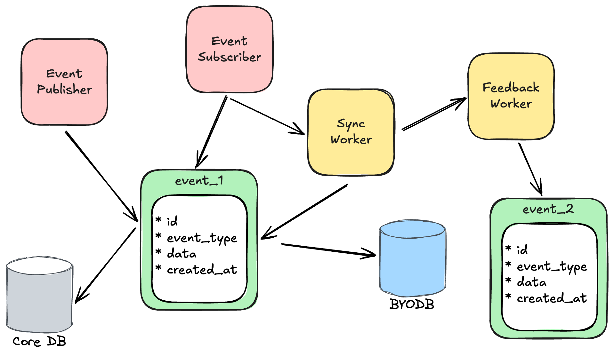

# Event Sourcing and Saga Pattern Sample Project

## Overview

This project demonstrates an implementation of Event Sourcing and Saga Pattern in a Rails application, focusing on managing database consistency across multiple databases.



## Key Features

- Dynamic table creation across different database systems
- Event-driven architecture
- Saga pattern for distributed transaction management
- Asynchronous processing with robust error handling

## Prerequisites

- Ruby 3.3.1
- Rails 8.0.0
- PostgreSQL

## Installation

1. Clone the repository
   ```
   git clone https://github.com/sasamuku/sample_event_sourcing.git
   cd sample_event_sourcing
   ```

2. Install dependencies
   ```
   bundle install
   ```

3. Start the docker compose
   ```
   docker compose up -d
   ```

4. Setup database
   ```
   bundle exec rails db:create
   bundle exec rails db:migrate
   ```

5. Start the server
   ```
   bundle exec rails server
   ```

## Core Components

- **Event Sourcing**: Tracks system state changes through event logs
- **Saga Pattern**: Manages distributed transactions with compensation mechanisms
- **Async Jobs**: Handle database synchronization tasks

## Core Gems

### Rails Event Store

- **URL**: [https://github.com/RailsEventStore/rails_event_store](https://github.com/RailsEventStore/rails_event_store)
- **Description**:
  - Ruby/Rails library for event sourcing
  - Enables event storage, streaming, and replay
- **Usage in this Project**:
  - Logging events for database schema changes
  - Reconstructing system state at any point in time

### Solid Queue

- **URL**: [https://github.com/rails/solid_queue](https://github.com/rails/solid_queue)
- **Description**:
  - Lightweight asynchronous job queueing system introduced in Rails 7.1
  - Database-based job queue enabling flexible asynchronous processing
- **Usage in this Project**:
  - Asynchronous execution of DDL operations
  - Job management in distributed transactions

### Sequel

- **URL**: [https://github.com/jeremyevans/sequel](https://github.com/jeremyevans/sequel)
- **Description**:
  - High-performance and flexible Ruby database toolkit
  - Provides abstraction layer for multiple databases
- **Usage in this Project**:
  - Flexible connection to external databases
  - Dynamic database schema manipulation

## Usage Example

Create a new table:

```bash
curl -X POST http://localhost:3000/table/create \
     -H "Content-Type: application/json" \
     -d '{"name": "my_new_table_123"}'
```

Delete a table:

```bash
curl -X POST http://localhost:3000/table/delete \
     -H "Content-Type: application/json" \
     -d '{"table_id": "2d7ea983-7844-4a1a-8b36-1dbc629d16e4"}'
```

Show table details:

```bash
curl -X POST http://localhost:3000/table/show \
     -H "Content-Type: application/json" \
     -d '{"table_id": "2d7ea983-7844-4a1a-8b36-1dbc629d16e4"}'
```

Add a column:

```bash
curl -X POST http://localhost:3000/table/column \
     -H "Content-Type: application/json" \
     -d '{"table_id": "2d7ea983-7844-4a1a-8b36-1dbc629d16e4", "column": {"name": "age", "type": "integer"}}'
```

Remove a column (by not specifying type):

```bash
curl -X POST http://localhost:3000/table/column \
     -H "Content-Type: application/json" \
     -d '{"table_id": "2d7ea983-7844-4a1a-8b36-1dbc629d16e4", "column": {"name": "age"}}'
```

## Architecture

The project implements a multi-database architecture with:
- Core DB for metadata
- BYODB for dynamic table creation
- Event-driven synchronization between databases

## Testing

Run test suite:
```
bundle exec rspec
```

## License

MIT License
